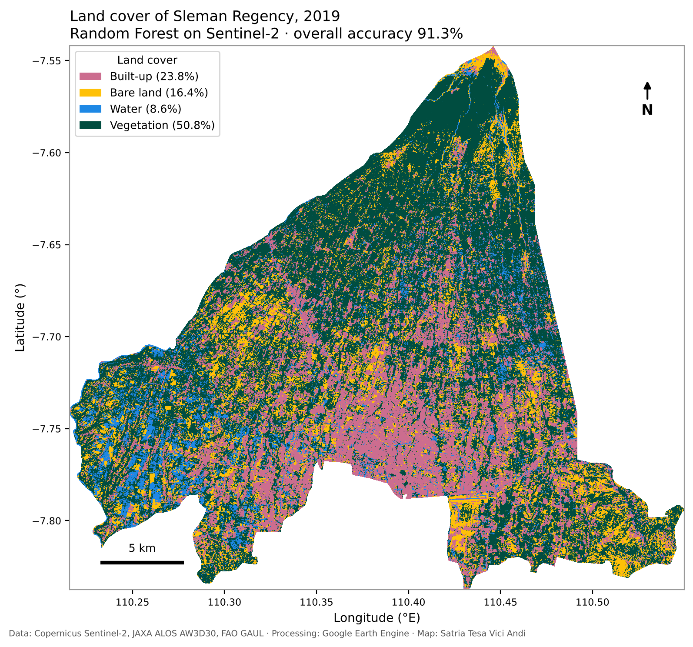
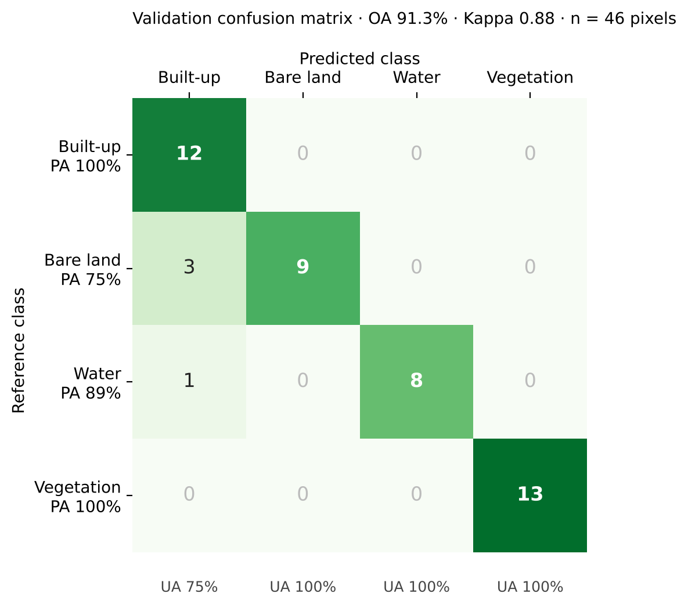
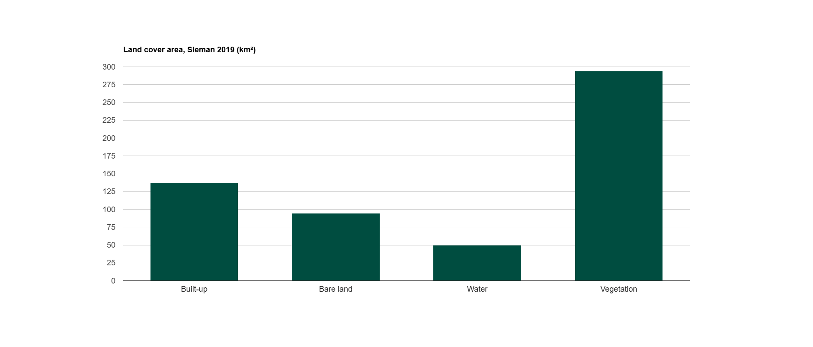
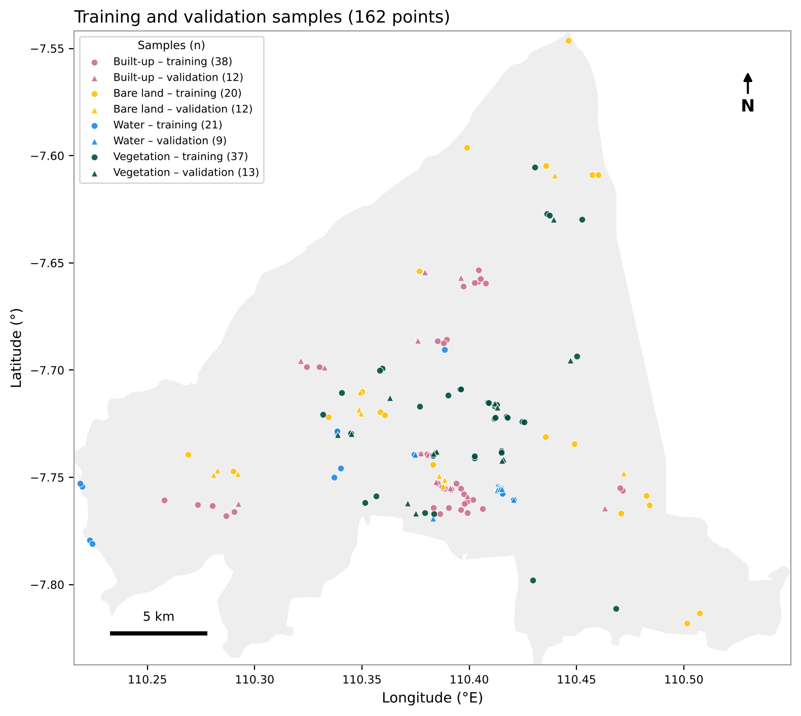
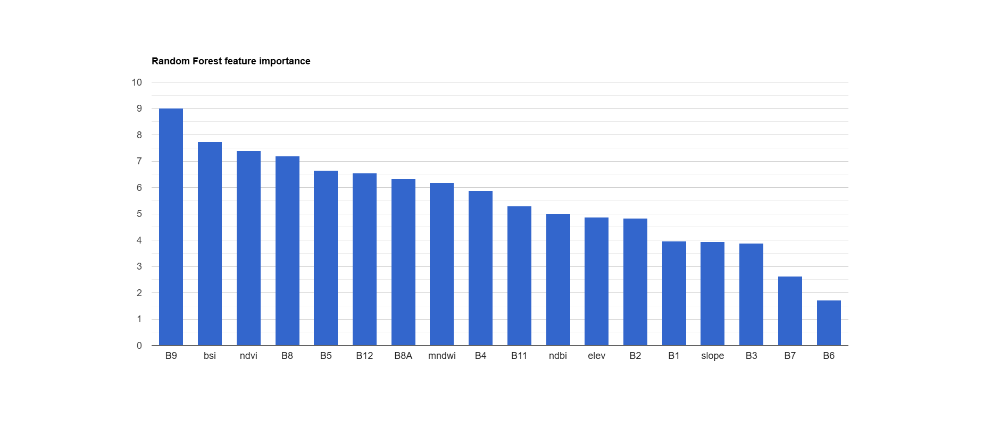
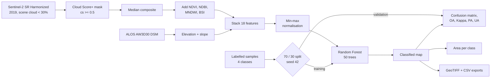
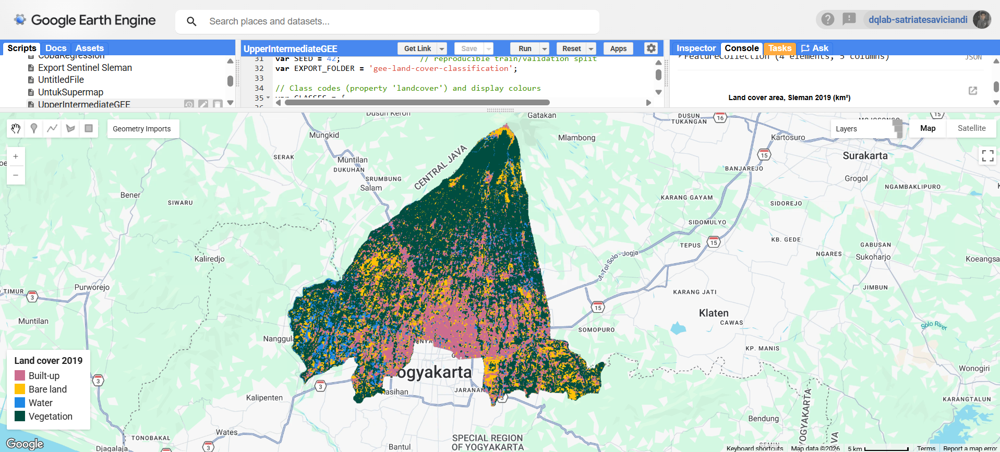

# Land Cover Classification of Sleman Regency with Google Earth Engine

Supervised **Random Forest** classification of a cloud-masked **Sentinel-2** composite (2019) into four land cover classes for Sleman Regency, Special Region of Yogyakarta, Indonesia. The workflow covers cloud masking, spectral indices, terrain features, normalisation, accuracy assessment, per-class area statistics, and export.



## Highlights

- **Cloud Score+** pixel-level masking on Sentinel-2 Surface Reflectance (Harmonized)
- **18 input features**: 12 Sentinel-2 bands, 4 spectral indices (NDVI, NDBI, MNDWI, BSI), elevation and slope from ALOS World 3D
- **Random Forest** (50 trees) with a reproducible 70/30 train–validation split
- **Accuracy assessment**: confusion matrix, overall accuracy, Kappa, producer's and user's accuracy
- **Area statistics** for every class in a single grouped reduction, plus feature-importance chart
- **Exports** of the classified GeoTIFF, accuracy metrics and class areas as CSV

## Results

The classifier reaches **91.3% overall accuracy** (Kappa **0.88**) on an independent validation set of 46 pixels. Vegetation covers just over half of the regency, and built-up land about a quarter.

| Metric | Value |
| --- | --- |
| Overall accuracy | 91.3% |
| Kappa coefficient | 0.88 |
| Validation pixels | 46 |



All errors fall into the built-up class: 3 of 12 bare-land and 1 of 9 water validation pixels were predicted as built-up, which lowers built-up user's accuracy to 75%.

**Area per class**

| Class | Code | Area (km²) | Share of regency |
| --- | --- | --- | --- |
| Vegetation | 3 | 294.0 | 50.8% |
| Built-up | 0 | 137.7 | 23.8% |
| Bare land | 1 | 94.6 | 16.4% |
| Water | 2 | 49.8 | 8.6% |



### Training samples

162 manually labelled points (50 built-up, 32 bare land, 30 water, 50 vegetation), split 116 training / 46 validation with a fixed seed.



### Feature importance

The water-vapour band B9 ranks first, ahead of the BSI and NDVI indices. At 60 m resolution B9 mostly carries atmospheric and elevation gradients (Merapi slopes to the lowlands), so part of its weight likely reflects where samples sit rather than what the land cover is. Red-edge bands B6 and B7 contribute least.



## Workflow



## Data

| Dataset | Earth Engine ID | Use |
| --- | --- | --- |
| Sentinel-2 MSI Level-2A (Harmonized) | `COPERNICUS/S2_SR_HARMONIZED` | Spectral bands, 10–20 m |
| Cloud Score+ for Sentinel-2 | `GOOGLE/CLOUD_SCORE_PLUS/V1/S2_HARMONIZED` | Pixel-level cloud mask |
| ALOS World 3D 30 m (v3.2) | `JAXA/ALOS/AW3D30/V3_2` | Elevation and slope |
| FAO GAUL 2015, level 2 | `FAO/GAUL/2015/level2` | Sleman Regency boundary |

## Land cover classes

| Code | Class | Colour |
| --- | --- | --- |
| 0 | Built-up | `#cc6d8f` |
| 1 | Bare land | `#ffc107` |
| 2 | Water | `#1e88e5` |
| 3 | Vegetation | `#004d40` |

## How to run

1. Open the [Earth Engine Code Editor](https://code.earthengine.google.com) and create a new script.
2. Paste [`scripts/landcover_rf_sleman.js`](scripts/landcover_rf_sleman.js).
3. Provide training samples in one of two ways:
   - **Draw them:** create four geometry imports named `urban`, `bare`, `water` and `vegetation` (type *FeatureCollection*), each with an integer property `landcover` that matches the class table.
   - **Load them:** upload [`data/sleman_lc_samples_2019.geojson`](data/) as an asset and switch STEP 5 to *Option B*.
4. Click **Run**. Results print to the Console; exports appear in the **Tasks** tab.

Adjust dates, thresholds, tree count and the split in the `CONFIGURATION` block at the top of the script.



### Regenerate the README figures (Python)

The map, sample map and confusion matrix are rendered from the GEE exports with `rasterio` and `matplotlib`:

```bash
pip install -r requirements.txt
python scripts/make_figures.py
```

## Repository structure

```
gee-land-cover-classification/
├── scripts/
│   ├── landcover_rf_sleman.js   # full workflow (Earth Engine Code Editor)
│   └── make_figures.py          # README figures from the exports (Python)
├── data/
│   └── sleman_lc_samples_2019.geojson   # 162 labelled sample points
├── results/
│   ├── sleman_landcover_2019.tif        # classified map, 10 m, EPSG:4326
│   ├── sleman_accuracy_2019.csv
│   └── sleman_class_areas_2019.csv
├── images/                      # figures and screenshots used in this README
├── requirements.txt
├── LICENSE
└── README.md
```

## Limitations and next steps

- **Small validation set.** 46 validation pixels give a wide confidence interval around the 91.3% accuracy; more samples per class would make the estimate more reliable.
- **Water is likely overestimated.** 49.8 km² (8.6%) is high for Sleman, which has few open water bodies. Much of the "water" class sits in the irrigated paddy belt of western Sleman, where flooded rice fields in the annual median composite read as water; a dry-season composite or a separate paddy class would fix this.
- **Clustered samples.** Points concentrate around the Yogyakarta urban fringe, and 16 of 30 water points come from one site. The western paddy belt and the upper Merapi slopes have few samples, so the map is least reliable there.
- **Bare land vs. built-up.** These two classes are spectrally close (3 of 12 bare-land validation pixels were predicted as built-up). Texture or SAR (Sentinel-1) features could help.
- **Random, not spatial, split.** Nearby training and validation samples can inflate accuracy; a spatially blocked split gives a more conservative estimate.
- **Next:** add a paddy class and more spatially spread samples, change detection (2019 vs. 2024), and comparison with ESA WorldCover.

## Credits

The workflow structure is adapted from the *End-to-End Google Earth Engine* course materials by Ujaval Gandhi, [Spatial Thoughts](https://courses.spatialthoughts.com/end-to-end-gee.html). Extensions in this repository include the BSI index, ALOS terrain features, a seeded split, Kappa and per-class accuracy, grouped area statistics, feature importance, and sample export.

A walkthrough of this analysis was published as *Upper-Intermediate Google Earth Engine* on [LinkedIn](https://www.linkedin.com/in/satriatesaviciandi).

## Author

**Satria Tesa Vici Andi** · GIS Engineer, GeoAI & WebGIS
[LinkedIn](https://www.linkedin.com/in/satriatesaviciandi) · [GitHub](https://github.com/satriatva)
